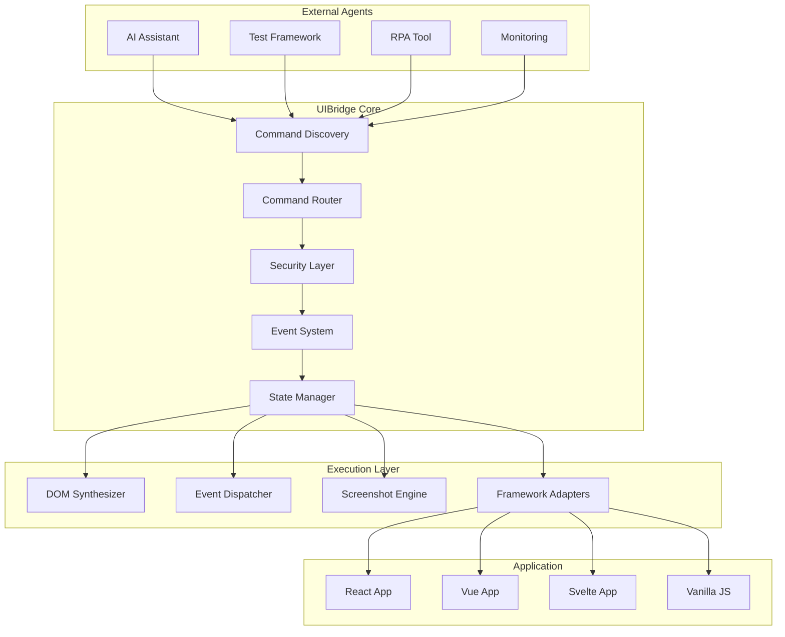

# Product Requirement Document (PRD)

## UIBridgeJS – In-App Command & Automation Framework
**Version:** 1.0  
**Date:** June 21, 2025  
**Status:** Draft

---

## Executive Summary

UIBridgeJS is a lightweight, framework-agnostic JavaScript library that enables external agents (AI assistants, testing frameworks, RPA tools) to control, verify, and document web applications from within the application context. Unlike traditional browser automation tools that operate externally, UIBridgeJS provides a secure, declarative interface directly embedded in the application, making it ideal for modern client-side frameworks and environments with strict security policies.

---

## 1. Problem Statement

### Current Challenges
1. **External Dependencies**: Traditional automation tools (Puppeteer, Playwright, Cypress) require full browser control and external runtime environments
2. **CSP Restrictions**: Strict Content Security Policies block external automation scripts
3. **Framework Complexity**: Client-side rendered apps (SPA/SSR) present challenges for traditional DOM-based automation
4. **AI Integration Barriers**: LLM-based tools struggle to interact with modern web apps due to lack of standardized interfaces
5. **Security Concerns**: External automation tools often require excessive permissions and network access
6. **Development Friction**: Setting up E2E testing environments is complex and time-consuming

### Opportunity
Create a standardized, secure, in-app automation layer that treats automation as a first-class citizen in web development, enabling seamless integration with AI agents, testing tools, and automation workflows.

---

## 2. Vision & Mission

### Vision
"Every web application becomes inherently automatable, testable, and AI-friendly through a simple, secure, built-in interface."

### Mission
Empower developers to add automation capabilities to their applications in under 10 minutes, while providing external agents with a reliable, discoverable, and secure way to interact with web applications.

---

## 3. Goals & Success Metrics

| Goal | Key Metric | Target | Measurement |
|------|------------|--------|-------------|
| **Rapid Adoption** | Time to first command | ≤ 5 minutes | Developer surveys |
| **Universal Compatibility** | Framework coverage | 95% of top JS frameworks | Integration tests |
| **Reliability** | Command success rate | ≥ 99.5% | Production telemetry |
| **Performance** | Runtime overhead | < 0.5% CPU/Memory | Benchmark suite |
| **Security** | Security vulnerabilities | 0 critical/high | Quarterly audits |
| **Developer Satisfaction** | NPS Score | > 50 | Quarterly surveys |
| **AI Integration** | Successful AI interactions | ≥ 90% | Agent feedback loops |

---

## 4. Target Audience & Use Cases

### Primary Users
1. **Frontend Developers**
   - Need: Quick integration, minimal configuration
   - Use Case: Adding automation hooks during development
   
2. **QA Engineers**
   - Need: Reliable test automation without flaky selectors
   - Use Case: Writing stable E2E tests that work across environments
   
3. **AI/LLM Developers**
   - Need: Structured interface for AI agents to interact with web apps
   - Use Case: Building AI assistants that can navigate and use web applications
   
4. **DevOps/SRE Teams**
   - Need: Production monitoring and synthetic testing
   - Use Case: Automated health checks and user journey monitoring

### Secondary Users
- RPA Developers (workflow automation)
- Accessibility Testers (automated a11y testing)
- Security Researchers (automated vulnerability scanning)
- Product Managers (automated demo generation)

### Key Use Cases

#### 1. AI-Assisted Development
```javascript
// AI agent discovers available commands
const commands = await fetch('/api/uibridge/discover');
// AI executes user intent: "Click the submit button and take a screenshot"
await uibridge.click('[data-test="submit"]');
const screenshot = await uibridge.screenshot();
```

#### 2. Robust E2E Testing
```javascript
// Tests use semantic selectors instead of brittle CSS
await uibridge.click({ label: 'Submit Order', type: 'button' });
await uibridge.waitFor({ text: 'Order Confirmed' });
```

#### 3. Production Monitoring
```javascript
// Synthetic monitoring scripts run in production
await uibridge.navigate('/checkout');
await uibridge.type({ label: 'Email' }, 'test@example.com');
const metrics = await uibridge.getPerformanceMetrics();
```

---

## 5. Product Scope & Features

### 5.1 Core Features (MVP)

#### Command Discovery Interface (CDI)
- **Auto-Discovery Endpoint**: `/api/uibridge/discover` returns available commands and their schemas
- **Runtime API**: `window.UIBridge.getCommands()` for dynamic discovery
- **Static Documentation**: Auto-generated `uibridge-commands.md` file with full API documentation
- **OpenAPI Schema**: Machine-readable command definitions for AI agents

#### Essential Commands
```typescript
interface CoreCommands {
  // Navigation & Interaction
  click(selector: Selector, options?: ClickOptions): Promise<void>;
  type(selector: Selector, text: string, options?: TypeOptions): Promise<void>;
  select(selector: Selector, value: string): Promise<void>;
  hover(selector: Selector): Promise<void>;
  focus(selector: Selector): Promise<void>;
  blur(): Promise<void>;
  
  // Navigation
  navigate(url: string): Promise<void>;
  reload(): Promise<void>;
  back(): Promise<void>;
  forward(): Promise<void>;
  
  // Verification & State
  exists(selector: Selector): Promise<boolean>;
  isVisible(selector: Selector): Promise<boolean>;
  getText(selector: Selector): Promise<string>;
  getValue(selector: Selector): Promise<string>;
  getAttribute(selector: Selector, attr: string): Promise<string>;
  
  // Documentation
  screenshot(options?: ScreenshotOptions): Promise<string>;
  getPageInfo(): Promise<PageInfo>;
  
  // Waiting & Timing
  wait(ms: number): Promise<void>;
  waitFor(condition: WaitCondition, timeout?: number): Promise<void>;
}
```

#### Smart Selectors
```typescript
type Selector = 
  | string  // CSS selector
  | { xpath: string }  // XPath
  | { text: string, type?: ElementType }  // Semantic selector
  | { label: string, type?: ElementType }  // Accessibility selector
  | { testId: string }  // data-testid selector
  | { ai: string }  // Natural language selector (AI-powered)
```

### 5.2 Advanced Features (Post-MVP)

#### AI-Optimized Features
- **Natural Language Commands**: `uibridge.execute("Click the blue submit button")`
- **Visual Element Recognition**: Click by screenshot or visual description
- **Context Awareness**: Commands understand page state and user flow
- **Auto-Healing Selectors**: Automatically fix broken selectors using AI

#### Developer Experience
- **Interactive Recorder**: Browser extension for recording user actions
- **Time-Travel Debugging**: Replay command sequences with state snapshots
- **Visual Regression Testing**: Built-in screenshot comparison
- **Performance Profiling**: Track impact of automation on app performance

#### Security & Governance
- **Command Auditing**: Full audit trail of all executed commands
- **Rate Limiting**: Configurable limits per origin/session
- **Sandbox Mode**: Restricted command set for untrusted agents
- **Encrypted Communication**: E2E encryption for sensitive operations

#### Framework-Specific Enhancements
```javascript
// React DevTools Integration
await uibridge.react.setProps('ComponentName', { value: 'new' });
await uibridge.react.getState('ComponentName');

// Vue DevTools Integration
await uibridge.vue.emit('ComponentName', 'eventName', data);

// SvelteKit Integration
await uibridge.sveltekit.goto('/path', { replaceState: true });
```

### 5.3 Plugin Ecosystem

```javascript
// Example: Visual Testing Plugin
UIBridge.use(VisualTestingPlugin, {
  baseline: './visual-baselines',
  threshold: 0.1
});

// Example: Accessibility Plugin
UIBridge.use(A11yPlugin, {
  rules: ['wcag2aa', 'section508']
});

// Example: Analytics Plugin
UIBridge.use(AnalyticsPlugin, {
  track: ['click', 'navigate', 'type']
});
```

---

## 6. Technical Architecture

### 6.1 High-Level Architecture



### 6.2 Communication Patterns

```javascript
// 1. HTTP Polling (Simple)
const commands = await fetch('/api/uibridge/execute', {
  method: 'POST',
  body: JSON.stringify({ command: 'click', args: ['#submit'] })
});

// 2. WebSocket (Real-time)
const ws = new WebSocket('ws://localhost:3000/uibridge');
ws.send(JSON.stringify({ command: 'click', args: ['#submit'] }));

// 3. PostMessage (Iframe/Extension)
window.postMessage({ 
  type: 'uibridge:command',
  command: 'click',
  args: ['#submit']
}, '*');

// 4. Direct API (In-App)
await window.UIBridge.click('#submit');
```

### 6.3 Security Model

```javascript
// Permission-based command execution
UIBridge.configure({
  permissions: {
    '*': ['read'],  // All origins can read
    'https://trusted.com': ['read', 'write', 'screenshot'],
    'http://localhost:*': ['*']  // Full access in development
  },
  rateLimits: {
    global: 100,  // Commands per minute
    perCommand: {
      screenshot: 10,
      click: 50
    }
  }
});
```

---

## 7. Implementation Requirements

### 7.1 Functional Requirements

| ID | Requirement | Priority | Acceptance Criteria |
|----|-------------|----------|-------------------|
| F1 | Command execution triggers native browser events | P0 | onClick handlers fire correctly |
| F2 | Screenshots capture full viewport in < 100ms | P0 | Performance benchmarks pass |
| F3 | Commands work across all major frameworks | P0 | Integration tests pass |
| F4 | Natural language selectors resolve correctly | P1 | 90% accuracy on test suite |
| F5 | Auto-healing fixes 80% of broken selectors | P1 | A/B test shows improvement |
| F6 | Commands can be replayed from audit log | P2 | Replay matches original execution |

### 7.2 Non-Functional Requirements

| Category | Requirement | Target |
|----------|-------------|--------|
| **Performance** | Library size | < 25KB gzipped |
| **Performance** | Command latency | < 10ms overhead |
| **Performance** | Memory usage | < 5MB baseline |
| **Compatibility** | Browser support | Chrome 90+, Firefox 88+, Safari 14+, Edge 90+ |
| **Compatibility** | Framework support | React 16+, Vue 3+, Angular 12+, Svelte 3+ |
| **Security** | CSP compliance | Works with strict CSP |
| **Security** | XSS prevention | No DOM-based XSS vulnerabilities |
| **Accessibility** | WCAG compliance | AA for all UI elements |
| **Reliability** | Uptime | 99.9% for cloud services |

---

## 8. API Design

### 8.1 Initialization

```javascript
import UIBridge from 'uibridge';

// Simple initialization
UIBridge.init();

// Advanced configuration
UIBridge.init({
  // Security
  apiKey: process.env.UIBRIDGE_API_KEY,
  allowedOrigins: ['https://app.example.com'],
  
  // Features
  features: {
    screenshots: true,
    recording: process.env.NODE_ENV === 'development',
    aiSelectors: true
  },
  
  // Callbacks
  onCommand: (cmd) => console.log('Command:', cmd),
  onError: (err) => console.error('Error:', err),
  
  // Custom selectors
  selectorStrategies: {
    custom: (selector) => document.querySelector(selector.custom)
  }
});
```

### 8.2 Command Examples

```javascript
// Basic interactions
await uibridge.click('#submit-button');
await uibridge.type('#email-input', 'user@example.com');

// Semantic selectors
await uibridge.click({ label: 'Submit Order' });
await uibridge.type({ placeholder: 'Enter your email' }, 'user@example.com');

// AI-powered selectors
await uibridge.click({ ai: 'the blue button next to the logo' });

// Chaining commands
await uibridge
  .navigate('/checkout')
  .waitFor({ text: 'Checkout' })
  .type({ label: 'Email' }, 'user@example.com')
  .click({ text: 'Continue' })
  .screenshot({ name: 'checkout-filled' });

// Assertions
const hasError = await uibridge.exists('.error-message');
const buttonText = await uibridge.getText('#submit-button');
```

### 8.3 Discovery API

```javascript
// GET /api/uibridge/discover
{
  "version": "1.0.0",
  "commands": [
    {
      "name": "click",
      "description": "Clicks an element",
      "parameters": {
        "selector": {
          "type": "Selector",
          "required": true,
          "description": "Element to click"
        },
        "options": {
          "type": "ClickOptions",
          "required": false,
          "properties": {
            "force": "boolean",
            "position": "center|topLeft|topRight|bottomLeft|bottomRight",
            "modifiers": "string[]"
          }
        }
      },
      "examples": [
        "uibridge.click('#submit')",
        "uibridge.click({ label: 'Submit' })",
        "uibridge.click({ ai: 'the submit button' })"
      ]
    }
  ],
  "schemas": {
    "Selector": { /* JSON Schema */ },
    "ClickOptions": { /* JSON Schema */ }
  }
}
```

---

## 9. Integration Patterns

### 9.1 Framework Integration

#### React
```jsx
import { UIBridgeProvider } from 'uibridge/react';

function App() {
  return (
    <UIBridgeProvider config={{ /* config */ }}>
      <YourApp />
    </UIBridgeProvider>
  );
}
```

#### Vue
```javascript
import { createUIBridge } from 'uibridge/vue';

app.use(createUIBridge({ /* config */ }));
```

#### SvelteKit
```javascript
// app.html
import { uibridge } from 'uibridge/sveltekit';
export const handle = uibridge({ /* config */ });
```

### 9.2 Testing Framework Integration

#### Playwright
```javascript
import { uibridgeFixture } from 'uibridge/playwright';

test.use(uibridgeFixture);

test('checkout flow', async ({ page, uibridge }) => {
  await page.goto('/');
  await uibridge.click({ label: 'Shop Now' });
  await uibridge.waitFor({ text: 'Products' });
});
```

#### Cypress
```javascript
import 'uibridge/cypress';

it('completes checkout', () => {
  cy.visit('/');
  cy.uibridge('click', { label: 'Shop Now' });
  cy.uibridge('waitFor', { text: 'Products' });
});
```

---

## 10. Competitive Analysis

| Feature | UIBridgeJS | Puppeteer | Playwright | Cypress | Selenium |
|---------|------------|-----------|------------|---------|----------|
| Runs in-app | ✅ | ❌ | ❌ | ❌ | ❌ |
| No external deps | ✅ | ❌ | ❌ | ❌ | ❌ |
| AI-ready API | ✅ | ❌ | ❌ | ❌ | ❌ |
| CSP compatible | ✅ | ⚠️ | ⚠️ | ✅ | ❌ |
| Framework agnostic | ✅ | ✅ | ✅ | ⚠️ | ✅ |
| < 30KB size | ✅ | ❌ | ❌ | ❌ | ❌ |
| Natural language | ✅ | ❌ | ❌ | ❌ | ❌ |
| Self-documenting | ✅ | ❌ | ❌ | ❌ | ❌ |

---

## 11. Risks & Mitigations

| Risk | Impact | Likelihood | Mitigation Strategy |
|------|--------|------------|-------------------|
| **Security exploits** | High | Medium | Security audits, bug bounty program |
| **Performance degradation** | Medium | Low | Lazy loading, web workers |
| **Framework conflicts** | Medium | Medium | Extensive integration testing |
| **Browser incompatibility** | High | Low | Progressive enhancement |
| **Adoption resistance** | High | Medium | Developer advocacy, clear ROI |
| **AI selector accuracy** | Medium | High | Fallback strategies, continuous training |

---

## 12. Timeline & Milestones

### Phase 1: Foundation (Weeks 1-4)
- Core architecture and plugin system
- Basic commands (click, type, navigate)
- Simple CDI implementation
- SvelteKit proof of concept

### Phase 2: MVP (Weeks 5-8)
- Screenshot functionality
- Framework adapters (React, Vue)
- Security layer
- Basic documentation
- **Milestone**: Beta release to 10 early adopters

### Phase 3: Enhanced Features (Weeks 9-12)
- AI-powered selectors
- Natural language commands
- Visual regression testing
- Advanced CDI with OpenAPI
- **Milestone**: Public beta launch

### Phase 4: Production Ready (Weeks 13-16)
- Performance optimization
- Security audit
- Comprehensive documentation
- Plugin marketplace
- **Milestone**: v1.0 GA release

### Phase 5: Ecosystem Growth (Months 5-6)
- Community plugins
- Enterprise features
- SaaS dashboard
- **Milestone**: 1000+ active projects

---

## 13. Success Criteria

### Short-term (3 months)
- [ ] 100+ GitHub stars
- [ ] 50+ projects using UIBridge
- [ ] 5+ framework integrations
- [ ] Zero critical security issues

### Medium-term (6 months)
- [ ] 1000+ weekly npm downloads
- [ ] 10+ community plugins
- [ ] Integration with major AI platforms
- [ ] First enterprise customer

### Long-term (12 months)
- [ ] Industry standard for in-app automation
- [ ] 10,000+ weekly downloads
- [ ] Major framework official support
- [ ] Sustainable business model

---

## 14. Open Questions

1. **Pricing Model**: Open source with paid enterprise features or fully open source?
2. **AI Integration**: Build our own NLP or integrate with OpenAI/Anthropic?
3. **Cloud Services**: Offer hosted discovery service or keep it fully client-side?
4. **Mobile Support**: Extend to React Native/Flutter in v2?
5. **Backend Commands**: Support for API testing within the same interface?
6. **Versioning Strategy**: How to handle breaking changes in command APIs?

---

## 15. Appendix

### A. Example Implementation

```javascript
// uibridge-commands.md (auto-generated)
# UIBridge Commands

## Available Commands

| Command | Description | Parameters |
|---------|-------------|------------|
| click | Clicks an element | selector, options? |
| type | Types text into an element | selector, text, options? |
| screenshot | Takes a screenshot | options? |

## Examples

\`\`\`javascript
// Click a button
await uibridge.click('#submit');

// Type with delay
await uibridge.type('#email', 'test@example.com', { delay: 50 });

// Take screenshot of specific element
await uibridge.screenshot({ selector: '.product-card' });
\`\`\`
```

### B. Security Considerations

```javascript
// Content Security Policy compatible
// No eval(), no inline scripts, nonce support
<script nonce="{{nonce}}" src="https://cdn.uibridge.dev/v1/uibridge.min.js"></script>

// Subresource Integrity
<script 
  src="https://cdn.uibridge.dev/v1/uibridge.min.js"
  integrity="sha384-..."
  crossorigin="anonymous">
</script>
```

### C. Performance Budget

```
Initial Load: < 25KB gzipped
Runtime Memory: < 5MB baseline
Command Overhead: < 10ms per command
Screenshot Generation: < 100ms for 1080p
```

---

*This document is a living specification and will be updated based on user feedback and technical discoveries.*