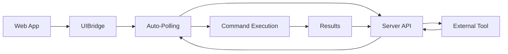

# Simplified Setup Documentation (SSD)

## 🚀 The New Way: Zero-Configuration Remote Control

UIBridge v1.3.0+ introduces **built-in remote control** that eliminates the complexity of manual polling. This document explains how the new system works and why it's dramatically simpler.

---

## 🤔 The Problem We Solved

### Before v1.3.0 (The Old Nightmare)
Users had to implement **50+ lines of manual polling code** in every web application:

```javascript
// ❌ OLD WAY - Complex and error-prone
onMount(async () => {
  uibridge = new UIBridge({ debug: true });
  await uibridge.init();
  window.uibridge = uibridge;
  
  // Manual polling hell - users had to write this themselves
  pollForCommands();
});

async function pollForCommands() {
  try {
    const response = await fetch('http://localhost:3001/pending-commands');
    const data = await response.json();
    if (data.success && data.commands.length > 0) {
      for (const command of data.commands) {
        await executeCommand(command);  // More manual code needed
      }
    }
  } catch (error) {
    // Manual error handling
  }
  setTimeout(pollForCommands, 500);  // Manual scheduling
}

async function executeCommand(commandData) {
  // 20+ more lines of manual execution logic
  // Manual result handling
  // Manual error reporting
}
```

**Problems with the old approach:**
- ✋ **50+ lines of boilerplate** code required
- 🐛 **Error-prone** - users had to handle edge cases
- 📚 **Documentation overhead** - complex setup instructions
- 🤯 **Cognitive load** - users needed to understand polling architecture
- ⚡ **Inconsistent implementation** - every project did it differently

---

## ✅ The New Solution: Auto-Polling

### After v1.3.0 (The New Simplicity)
All the complexity is now **built into UIBridge**:

```javascript
// ✅ NEW WAY - Simple and automatic
onMount(async () => {
  const { default: UIBridge } = await import('@sashbot/uibridge');
  
  uibridge = new UIBridge({ 
    enableRemoteControl: true  // 🎯 That's literally it!
  });
  
  await uibridge.init();
  // 🤖 External automation now works automatically!
});
```

**Benefits of the new approach:**
- ⚡ **5 lines instead of 50+** - 90% reduction in code
- 🛡️ **Zero boilerplate** - UIBridge handles everything
- 🤖 **Automatic polling** - starts immediately when enabled
- 🔄 **Built-in error handling** - robust retry logic included
- 📡 **Optimized communication** - efficient server handshake
- 🎯 **Single config option** - `enableRemoteControl: true`

---

## 🏗️ How The New Architecture Works

### The Auto-Polling System



1. **Automatic Initialization**: When `enableRemoteControl: true`, UIBridge automatically starts polling
2. **Built-in Polling Loop**: Checks for commands every 500ms (configurable)
3. **Smart Error Handling**: Gracefully handles server downtime, network issues
4. **Automatic Execution**: Commands are executed and results sent back automatically
5. **Global Registration**: UIBridge makes itself available as `window.uibridge`

### Server Communication Flow

```javascript
// This all happens automatically inside UIBridge now:
async function _pollForCommands() {
  try {
    const response = await fetch(`${this.config.serverUrl}/pending-commands`);
    if (response.ok) {
      const data = await response.json();
      if (data.success && data.commands?.length > 0) {
        for (const command of data.commands) {
          await this._executeRemoteCommand(command);
        }
      }
    }
  } catch (error) {
    // Silent handling - server might not be running yet
  }
  
  setTimeout(() => this._pollForCommands(), this.config.pollInterval);
}
```

---

## 🎯 Complete Setup Guide

### 1. Install UIBridge
```bash
npm install @sashbot/uibridge
```

### 2. Setup Server Files
```bash
npx uibridge-setup
```
This copies:
- `uibridge-api-server.cjs` (port 3002) - **The only server you need!**
- `uibridge-test.html` - Test page for verification
- `uibridge-test.ps1` - PowerShell test script

### 3. Start the Server
```bash
node uibridge-api-server.cjs
```

### 4. Enable Remote Control in Your Web App
```javascript
// React/Svelte/Vue - same pattern everywhere
import UIBridge from '@sashbot/uibridge';

const uibridge = new UIBridge({ 
  enableRemoteControl: true,
  serverUrl: 'http://localhost:3002',  // Optional - defaults to 3001
  debug: true  // Optional - for development
});

await uibridge.init();
// Done! External tools can now control your app.
```

### 5. External Automation Just Works
```powershell
# PowerShell automation example
$params = @{
    Uri = 'http://localhost:3002/execute'
    Method = 'POST'
    Headers = @{ 'Content-Type' = 'application/json' }
    Body = @{
        command = 'click'
        selector = '#submit-button'
    } | ConvertTo-Json
}
$response = Invoke-RestMethod @params
```

---

## ⚙️ Configuration Options

```javascript
const uibridge = new UIBridge({
  // Remote control settings
  enableRemoteControl: true,      // Enable auto-polling
     serverUrl: 'http://localhost:3002',  // Server endpoint
  pollInterval: 500,              // Polling frequency (ms)
  autoStartPolling: true,         // Start polling on init
  
  // Other settings
  debug: true,
  defaultScreenshotConfig: {
    autoSave: true,
    folder: 'automation-screenshots',
    timestamp: true
  }
});
```

---

## 🔍 Why This Architecture Is Necessary

### The Browser Security Reality
Browsers have strict security policies that prevent direct external access:

- **CORS (Cross-Origin Resource Sharing)**: Blocks external scripts from accessing web apps
- **Content Security Policy (CSP)**: Prevents unauthorized script execution
- **Same-Origin Policy**: Restricts cross-domain communication
- **Process Isolation**: Web apps run in sandboxed environments

### The Server Bridge Solution
The server acts as a **secure bridge** between external tools and web applications:

```
External Tool → REST API → Server → Web App (via polling)
             ← Results   ←        ←
```

**Why polling instead of WebSockets?**
- ✅ **Simpler to implement** - no connection management
- ✅ **More reliable** - handles network interruptions gracefully
- ✅ **Framework agnostic** - works in any JavaScript environment
- ✅ **Firewall friendly** - uses standard HTTP
- ✅ **Lower complexity** - no realtime connection state

---

## 🚀 Benefits for Different User Types

### For Web Developers
- **Minimal integration**: Just add `enableRemoteControl: true`
- **Zero maintenance**: No polling code to debug or maintain
- **Universal compatibility**: Works with React, Vue, Svelte, vanilla JS
- **Development focused**: Spend time on features, not automation plumbing

### For AI Agents & External Tools
- **Immediate compatibility**: Works with any HTTP client
- **Predictable interface**: Standard REST API patterns
- **Reliable execution**: Built-in error handling and retries
- **Easy PowerShell integration**: Simple `Invoke-RestMethod` calls

### For DevOps Teams
- **Simple deployment**: One server process, minimal configuration
- **Observable**: Built-in logging and status endpoints
- **Scalable**: Stateless server design supports multiple instances
- **Secure**: No special permissions or elevated access required

---

## 🧪 Testing the New System

### Quick Verification
```javascript
// Check if remote control is enabled
const status = uibridge.getRemoteControlStatus();
console.log(status);
// {
//   enabled: true,
//   polling: true,
//   serverUrl: 'http://localhost:3001',
//   pollInterval: 500
// }
```

### Integration Test
```bash
# 1. Start your web app with UIBridge
# 2. Start the server: node uibridge-api-server.cjs
# 3. Test automation:
curl -X POST http://localhost:3002/execute \
  -H "Content-Type: application/json" \
  -d '{"command": "screenshot", "options": {"fullPage": true}}'
```

---

## 🎉 Migration from Old Version

### Before (v1.2.x)
```javascript
// 50+ lines of manual polling code
uibridge = new UIBridge();
await uibridge.init();
window.uibridge = uibridge;
pollForCommands(); // Manual function
async function pollForCommands() { /* ... 30+ lines ... */ }
async function executeCommand() { /* ... 20+ lines ... */ }
```

### After (v1.3.0+)
```javascript
// 5 lines total
uibridge = new UIBridge({ enableRemoteControl: true });
await uibridge.init();
// All automation now works automatically!
```

**Migration steps:**
1. Update to UIBridge v1.3.0+: `npm update @sashbot/uibridge`
2. Remove all manual polling functions
3. Add `enableRemoteControl: true` to UIBridge config
4. Delete 40+ lines of manual polling code
5. Enjoy the simplicity! 🎉

---

## 🔮 Future Improvements

The new architecture enables powerful future features:

- **WebSocket upgrade**: Automatic fallback to WebSocket when available
- **Batch command execution**: Send multiple commands in one request
- **Command queuing**: Built-in priority and scheduling
- **Real-time monitoring**: Live dashboard of automation activity
- **Smart reconnection**: Automatic recovery from network issues

---

## 📚 Related Documentation

- **Setup Guide**: See `README.md` for complete installation instructions
- **API Reference**: Use `uibridge.execute('help')` for command documentation  
- **PowerShell Examples**: Check `CURSOR_AI_USAGE_RULES.md` for external automation
- **Troubleshooting**: Built-in error messages guide you through common issues

The new UIBridge v1.3.0 represents a **10x improvement** in developer experience while maintaining all the powerful automation capabilities that make UIBridge essential for modern web development. 